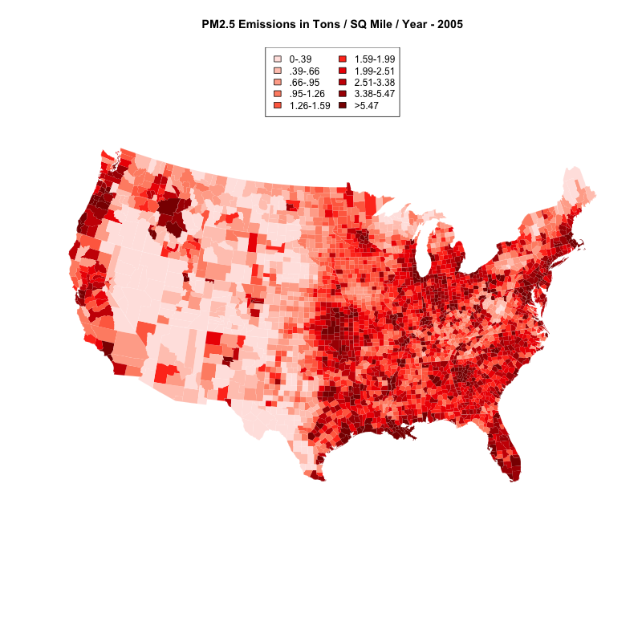
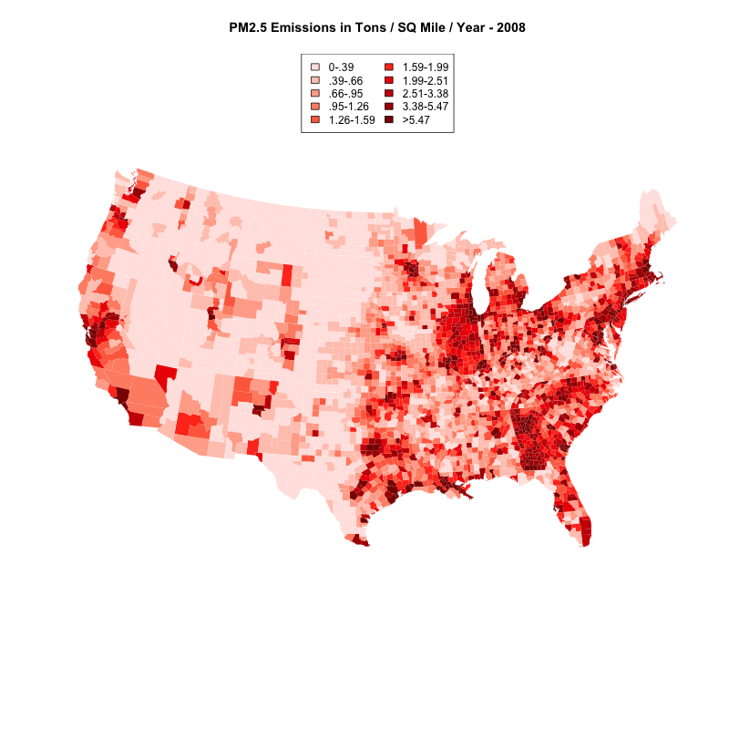

<br>

#### Part 2: not completed yet.
<br>
This project will map PM 2.5 emissions by county across the United States.

<br>
The data that we're using comes from these sources: 

*  NEI (National Emissions Inventory) data from the EPA: https://d396qusza40orc.cloudfront.net/exdata%2Fdata%2FNEI_data.zip  
*  Fips county code and county area data (ACS_09_5YR_G001_with_ann.csv) came from factfinder.census.gov  

<br>
Just grab the data here:

* [NEI Data](summarySCC_PM25.rds)

* [County Fips and Area Data](summarySCC_PM25.rds)

<br>

###  Loading Data and Libraries

<br>

Start by loading the relevant libraries.

<br>
```{r, cache=TRUE}
library("data.table")
library("colorspace")
library("maps")
library("mapproj")
```
<br>
The maps library has fips county data, load that using the data command. Each county in the country has a unique fips code. 
<br>
```{r, cache=TRUE}
data(county.fips)
head(county.fips)
```

<br>  

This first step reads the emissions data into a data.table. This will give emissions for each source within each county in the country. This is a large data.table since each county has many emissions sources but you can see that the table has the fips code for each emissions source, the year, and the level of emissions.
<br>

```{r, cache=TRUE}
NEI <- readRDS('summarySCC_PM25.rds')
NEI <- data.table(NEI)
head(NEI)
nrow(NEI)
```

<br>

This step reads the county data into R which includes FIPS codes and county area by square mile. It also has a number of columns with no data in them and which we don't need which is why it's 38 columns instead of just two or three that would be useful for this project. 

<br>

```{r,cache=TRUE}
countyfips <- fread('ACS_09_5YR_G001_with_ann.csv', header = TRUE)
setnames(countyfips, old = colnames(countyfips), new = as.character(countyfips[1,]))
countyfips <- countyfips [-1, ]
dim(countyfips)
```

<br>

### Shape the Data

<br>

This next step aggregates the NEI data returning total tons by fips/county and year. Each county will have 4 rows, one for each year in the data set. 
 [More info about data.table aggregation](http://rprogramming.net/aggregate-data-in-r-using-data-table/)  

<br>

```{r, cache=TRUE}
NEI_fips_year_aggregate <- as.data.table(NEI[, j = list(Emissions = sum(Emissions, na.rm = TRUE)), by = list(fips, year)])
head(NEI_fips_year_aggregate)
```

<br>

The county with the highest amount of PM2.5 emissions was the Yukon-Koyukuk Census Area in AK. This county has an area of 147,000 sq miles which is 14 times the size of Massachusetts. It doesn't make sense for an area that large to indicate that there are more emissions than a county like Los Angeles which has lower total emissions but probably more per square mile, so now I take the emissions data and divide it by the area of each county to give emissions per square mile. 


<br>

In this step I create data table's for each year of pollution data. 

<br>

```{r, cache=TRUE}
NinetyNine <- NEI_fips_year_aggregate[NEI_fips_year_aggregate$year == 1999, ]
ZeroTwo <- NEI_fips_year_aggregate[NEI_fips_year_aggregate$year == 2002, ]
ZeroFive <- NEI_fips_year_aggregate[NEI_fips_year_aggregate$year == 2005, ] 
ZeroEight <- NEI_fips_year_aggregate[NEI_fips_year_aggregate$year == 2008, ]
head(NinetyNine)
```

<br>

Now I create a function called divideEmissionsBySqMiles. This function takes emissions data for a particular fips, finds the area in square miles for that fips in the countyfips file, and returns a vector with emissions/square miles. This function does not work with data sets where a fips code is listed more than once. It can't be used with NEI_fips_year_aggregate because there are four emission records and four years for each fips code and so each fips code appears four times.

<br>

```{r, cache=TRUE}
divideEmissionsBySqMiles <- function (emissionsdata,  SqMilesData = countyfips) {
  vec <- numeric()
  x <- 0
  for (i in emissionsdata$fips){  
    x <- x + 1
    vec <- append(vec, emissionsdata[emissionsdata$fips == i, Emissions] / as.numeric(SqMilesData[SqMilesData$Id2 == i, 38, with = FALSE ]))        
  } 
  return (vec)
}
```

<br>

Now run divideEmissionsBySqMiles and cbind the vector results to each years data.table

<br>

```{r, cache=TRUE}
NinetyNine <- cbind(NinetyNine, emissionsSqMiles = divideEmissionsBySqMiles(NinetyNine))
ZeroTwo <- cbind(ZeroTwo, emissionsSqMiles = divideEmissionsBySqMiles(ZeroTwo))
ZeroFive <- cbind(ZeroFive, emissionsSqMiles = divideEmissionsBySqMiles(ZeroFive))
ZeroEight <- cbind(ZeroEight, emissionsSqMiles = divideEmissionsBySqMiles(ZeroEight))
head(NinetyNine)
```
<br>

###  Showing the Data

<br>
Create a color palette. I ended up using one I found in ~~http://colorbrewer2.org~~ https://gka.github.io/palettes/
<br>
```{r, cache=TRUE}
Emissions_palette4 <- c("#ffe4e1", "#ffc9bd", "#ffad98", "#ff8f73", "#ff6d4e", "#ff3d21", "#ee0001", "#cb0002", "#ab0002", "#8b0000")

```

<br>

I'm putting each county into one of 10 different emissions brackets depending on the level of emissions. This step will create one long list of all the Emissions/SqMile for the four years in the data set, then divide the full list into ten equal groups.

<br>
```{r, cache=TRUE}
TotalDecile <- c(NinetyNine$emissionsSqMiles, ZeroTwo$emissionsSqMiles, ZeroFive$emissionsSqMiles, ZeroEight$emissionsSqMiles)
EmissionDecile <- quantile(TotalDecile, probs=seq(0,1, by=0.1), na.rm = TRUE)
EmissionDecile
```

<br>

Now create a column in each table called colorbuckets that sorts each fips county into one of the deciles

<br>

```{r, cache=TRUE}
NinetyNine$colorbuckets <- as.numeric(cut(NinetyNine$emissionsSqMiles, EmissionDecile))
ZeroTwo$colorbuckets <- as.numeric(cut(ZeroTwo$emissionsSqMiles, EmissionDecile))
ZeroFive$colorbuckets <- as.numeric(cut(ZeroFive$emissionsSqMiles, EmissionDecile))
ZeroEight$colorbuckets <- as.numeric(cut(ZeroEight$emissionsSqMiles, EmissionDecile))
head(NinetyNine)
```

<br>

Match the fips codes from the NEI data set and the data map set that lists county square miles. 

<br>

```{r, cache=TRUE}
cnty.fips <- county.fips$fips[match(map("county", plot=FALSE)$names,
                                    county.fips$polyname)]
head(county.fips$fips[match(map("county", plot = FALSE)$names, county.fips$polyname)])
cnty.fips[1] == as.numeric(NinetyNine[67,1, with=FALSE])
```
<br>

<br>
```{r, cache=TRUE}
NinetyNineColorsMatched <- NinetyNine$colorbuckets[match(cnty.fips, as.numeric(NinetyNine$fips))]
ZeroTwoColorsMatched <- ZeroTwo$colorbuckets[match(cnty.fips, as.numeric(ZeroTwo$fips))]
ZeroFiveColorsMatched <- ZeroFive$colorbuckets[match(cnty.fips, as.numeric(ZeroFive$fips))]
ZeroEightColorsMatched <- ZeroEight$colorbuckets[match(cnty.fips, as.numeric(ZeroEight$fips))]
head(NinetyNineColorsMatched)
```

<br>

This will create text that will go in the legend of the maps.

<br>

```{r, cache=TRUE}
leg.txt <- c("0-.39", ".39-.66", ".66-.95", ".95-1.26",
             "1.26-1.59", "1.59-1.99", "1.99-2.51", "2.51-3.38", "3.38-5.47", ">5.47")
```


<br>
<br>

###  1999 Emissions Map 

<br>

This will output the 1999 map as a png file.

<br>

```{r, cache=TRUE}
png (file = 'PM25Emissions1999.png', width = 800, height = 800, pointsize = 12)  
map("county", col = Emissions_palette4[NinetyNineColorsMatched], fill = TRUE, resolution = 0, lty = 0, projection = "polyconic") 
map("state", col = "white", fill = FALSE, add = TRUE, lty = 1, lwd = 0.2, projection="polyconic")  
title("PM2.5 Emissions in Tons / SQ Mile / Year - 1999")  
legend("top", fill = (Emissions_palette4), legend = (leg.txt), ncol = 2)  
dev.off() 
```


<br>

###  2002 Emissions Map

```{r, cache=TRUE}
png (file = 'PM25Emissions2002.png', width = 800, height = 800, pointsize = 12)
map("county", col = Emissions_palette4[ZeroTwoColorsMatched], fill = TRUE, resolution = 0,
    lty = 0, projection = "polyconic")

map("state", col = "white", fill = FALSE, add = TRUE, lty = 1, lwd = 0.2,
    projection="polyconic")

title("PM2.5 Emissions in Tons / SQ Mile / Year - 2002")
legend("top", fill = (Emissions_palette4),
       legend = (leg.txt), ncol = 2)
dev.off()
```


### 2005 Emissions Map

```{r, cache=TRUE}
png (file = 'PM25Emissions2005.png', width = 800, height = 800, pointsize = 12)
map("county", col = Emissions_palette4[ZeroFiveColorsMatched], fill = TRUE, resolution = 0,
    lty = 0, projection = "polyconic")

map("state", col = "white", fill = FALSE, add = TRUE, lty = 1, lwd = 0.2,
    projection="polyconic")

title("PM2.5 Emissions in Tons / SQ Mile / Year - 2005")
legend("top", fill = (Emissions_palette4),
       legend = (leg.txt), ncol = 2)
dev.off()
```



### 2008 Emissions Map

```{r, cache=TRUE}
png (file = 'PM25Emissions2008.png', width = 800, height = 800, pointsize = 12)
map("county", col = Emissions_palette4[ZeroEightColorsMatched], fill = TRUE, resolution = 0,
    lty = 0, projection = "polyconic")

map("state", col = "white", fill = FALSE, add = TRUE, lty = 1, lwd = 0.2,
    projection="polyconic")

title("PM2.5 Emissions in Tons / SQ Mile / Year - 2008")
legend("top", fill = (Emissions_palette4),
       legend = (leg.txt), ncol = 2)
dev.off()
```


<br>

***

These maps are fine as far as they go, they do show declines in emissions nationwide from 1999 to 2008, but they also show you where people live in the United States. Pet Peeve #208 Geographic Profile Maps Which Are Basically Just Population Maps. From [XKCD](http://xkcd.com/1138/):
<br>
<br>
<center>

</center>

<br>

<br>

####  Part 2: to be continued.

<br>