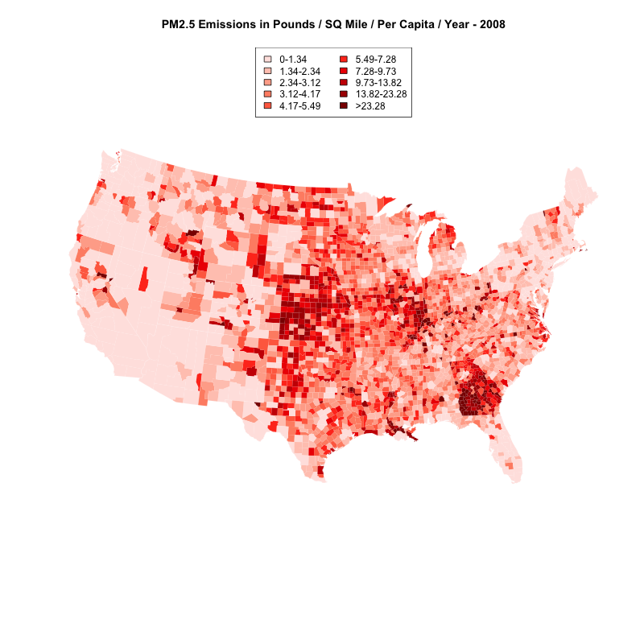

<br>
This project will map annual PM 2.5 emissions divided by square miles and population over four years, 1999, 2002, 2005, and 2008.
<br>

All the data files that I use are available here:

* [1998 - 1999 Census Estimates](9899CensusEstimate.csv)

* [2000 - 2008 Census Data](CO-EST2008-ALLDATA.csv)

This data originally came from here: [https://www.census.gov/popest/data/historical/index.html](https://www.census.gov/popest/data/historical/index.html) 

```{r, echo=FALSE, message=FALSE, warning=FALSE, cache=FALSE}
library("data.table")
library("colorspace")
library("maps")
library("mapproj")
```

```{r, echo=FALSE, message=FALSE, warning=FALSE, cache=TRUE}
data(county.fips)
NEI <- readRDS('summarySCC_PM25.rds')
NEI <- data.table(NEI)
countyfips <- fread('ACS_09_5YR_G001_with_ann.csv', header = TRUE)
setnames(countyfips, old = colnames(countyfips), new = as.character(countyfips[1,]))
countyfips <- countyfips [-1, ]
NEI_fips_year_aggregate <- as.data.table(NEI[, j = list(Emissions = sum(Emissions, na.rm = TRUE)), by = list(fips, year)])
NinetyNine <- NEI_fips_year_aggregate[NEI_fips_year_aggregate$year == 1999, ]
ZeroTwo <- NEI_fips_year_aggregate[NEI_fips_year_aggregate$year == 2002, ]
ZeroFive <- NEI_fips_year_aggregate[NEI_fips_year_aggregate$year == 2005, ] 
ZeroEight <- NEI_fips_year_aggregate[NEI_fips_year_aggregate$year == 2008, ]
divideEmissionsBySqMiles <- function (emissionsdata,  SqMilesData = countyfips) {
  vec <- numeric()
  x <- 0
  for (i in emissionsdata$fips){  
    x <- x + 1
    vec <- append(vec, emissionsdata[emissionsdata$fips == i, Emissions] / as.numeric(SqMilesData[SqMilesData$Id2 == i, 38, with = FALSE ]))        
  } 
  return (vec)
}
NinetyNine <- cbind(NinetyNine, emissionsSqMiles = divideEmissionsBySqMiles(NinetyNine))
ZeroTwo <- cbind(ZeroTwo, emissionsSqMiles = divideEmissionsBySqMiles(ZeroTwo))
ZeroFive <- cbind(ZeroFive, emissionsSqMiles = divideEmissionsBySqMiles(ZeroFive))
ZeroEight <- cbind(ZeroEight, emissionsSqMiles = divideEmissionsBySqMiles(ZeroEight))

cnty.fips <- county.fips$fips[match(map("county", plot=FALSE)$names, county.fips$polyname)]

```
<br>

###  Loading Data

<br>

Picking up from the earlier project, start by reading two new data files into R using fread. Because the census is conducted only once every 10 years the data for these years are estimates. The data is split into two separate files, the 98-99 data was in a text file which I processed into a csv before bringing it into R and the 2000-2008 data was in a separate csv file available from the census.gov website.  

<br>

```{r, cache=TRUE}
CensusEstimate9899 <- fread('9899CensusEstimate.csv', header = TRUE)
CensusEstimate0008 <- fread('CO-EST2008-ALLDATA.csv', header = TRUE)
head(CensusEstimate9899)
head(CensusEstimate0008)
```

<br>

###Format the data

<br>

The population data in the 98 - 99 data set is character data and has commas as a thousands separator. Just using the as.numeric function will return NA's because it can't handle the commas. Remove the commas using gsub then convert to numeric data.

<br>

```{r, cache=TRUE}
CensusEstimate9899$`7/1/99 Estimate`<- as.numeric(gsub(",","",CensusEstimate9899$`7/1/99 Estimate`))
```

<br>

The FIPS codes in the 98-99 population data are numeric data which sometimes is only 4 digits for codes that start with a 0. Convert to five digit integers using sprintf and as.integer.

<br>

```{r, cache=TRUE}
CensusEstimate9899$Fips <- sprintf("%05d", as.integer(CensusEstimate9899$Fips))

head(CensusEstimate9899)
```

<br>

Now we take the Emissions / SqMile data and divide it by the population of each county. Similar to the divideEmissionsBySqMiles function, this for loop finds the emissions / SqMile data and divides it by the population of each county.

<br>

```{r, cache=TRUE}
vec <- numeric()
for (i in NinetyNine$fips){
  vec <- append(vec, NinetyNine[NinetyNine$fips == i, emissionsSqMiles] / as.numeric(CensusEstimate9899[CensusEstimate9899$Fips == i, '7/1/99 Estimate', with=FALSE]))  
}
```

<br>

Cbind the results of the function to the NinetyNine data.table and multiply by 100,000 to get tons per 100,000 people.

<br>

```{r, cache=TRUE}
NinetyNine <- cbind(NinetyNine, emissionsSqMilePerCapita = vec * 100000)
rm(vec,i)
head(NinetyNine)
```

<br>

Get FIPS code in 2000 - 2008 data. The fips code in this data set is split into two columns, State and County. States codes that are lower than 10 are just one digit, and county codes that are less than 100 are two or one digit. Use sprintf and as.integer to make them the correct two and three digit lengths.

<br>

```{r, cache=TRUE}
CensusEstimate0008$STATE <- sprintf("%02d", as.integer(CensusEstimate0008$STATE))  
CensusEstimate0008$COUNTY <- sprintf("%03d", as.integer(CensusEstimate0008$COUNTY)) 
```
<br>

Then concatenate them to create the full five digit Fips code. 

<br>
```{r, cache=TRUE}
CensusEstimate0008$FIPS <- paste(CensusEstimate0008$STATE, CensusEstimate0008$COUNTY, sep="")
```
<br>

Create a function similar to the earlier divideEmissionsBySqMiles function that divides the Emissions per square mile by the population of each county.

<br>

```{r, cache=TRUE}
divideEmissionsPerSqMileByPopulation <- function (emissionsData,  populationData, columnNumber) {
  vec <- numeric()
  for (i in emissionsData$fips){
    vec <- append(vec, as.numeric(emissionsData[emissionsData$fips == i, 4, with=FALSE]) / as.numeric(populationData[populationData$FIPS == i, columnNumber, with=FALSE]))   
  }
  return(vec)
}
```

<br>

Run the function and multiply the result by 100,000 to get tons of emissions per 100,000 people.

<br>

```{r, cache=TRUE}
ZeroTwo <- cbind(ZeroTwo, emissionsSqMilePerCapita = divideEmissionsPerSqMileByPopulation(ZeroTwo,CensusEstimate0008, 12) * 100000)

ZeroFive <- cbind(ZeroFive, emissionsSqMilePerCapita = divideEmissionsPerSqMileByPopulation(ZeroFive,CensusEstimate0008, 15) * 100000)

ZeroEight <- cbind(ZeroEight, emissionsSqMilePerCapita = divideEmissionsPerSqMileByPopulation(ZeroEight,CensusEstimate0008, 18) * 100000)
```

<br>

Split the emissions into deciles

<br>

```{r, cache=TRUE}
DecileEmissionsCapitaTons <- quantile(c(NinetyNine$emissionsSqMilePerCapita, ZeroEight$emissionsSqMilePerCapita, ZeroFive$emissionsSqMilePerCapita, ZeroTwo$emissionsSqMilePerCapita), probs=seq(0,1, by=0.1), na.rm = TRUE)
DecileEmissionsCapitaTons
```

<br>

###  Mapping the Data

<br>

Create color buckets

<br>

```{r, cache=TRUE}
NinetyNine$colorbucketsTonsEmissions <- as.numeric(cut(NinetyNine$emissionsSqMilePerCapita, DecileEmissionsCapitaTons))
ZeroTwo$colorbucketsTonsEmissions <- as.numeric(cut(ZeroTwo$emissionsSqMilePerCapita, DecileEmissionsCapitaTons))
ZeroFive$colorbucketsTonsEmissions <- as.numeric(cut(ZeroFive$emissionsSqMilePerCapita, DecileEmissionsCapitaTons))
ZeroEight$colorbucketsTonsEmissions <- as.numeric(cut(ZeroEight$emissionsSqMilePerCapita, DecileEmissionsCapitaTons))
```

<br>

Then create vectors for each year that will tell R which color bucket to use for each county.

<br>

```{r, cache=TRUE}
NinetyNineColorsMatched <- NinetyNine$colorbucketsTonsEmissions[match(cnty.fips, as.numeric(NinetyNine$fips))]
ZeroTwoColorsMatched <- ZeroTwo$colorbucketsTonsEmissions[match(cnty.fips, as.numeric(ZeroTwo$fips))]
ZeroFiveColorsMatched <- ZeroFive$colorbucketsTonsEmissions[match(cnty.fips, as.numeric(ZeroFive$fips))]
ZeroEightColorsMatched <- ZeroEight$colorbucketsTonsEmissions[match(cnty.fips, as.numeric(ZeroEight$fips))]
```

<br>

Create the legend for each map.

<br>

```{r, cache=FALSE}
EmissionsPerCapitaLegend.txt <- c("0-1.34", "1.34-2.34", "2.34-3.12", "3.12-4.17", "4.17-5.49", "5.49-7.28", "7.28-9.73", "9.73-13.82", "13.82-23.28", ">23.28")
```

<br>

Create a color palette. I ended up using one I found in ~~http://colorbrewer2.org~~ https://gka.github.io/palettes/

<br>

```{r, cache=TRUE}
Emissions_palette4 <- c("#ffe4e1", "#ffc9bd", "#ffad98", "#ff8f73", "#ff6d4e", "#ff3d21", "#ee0001", "#cb0002", "#ab0002", "#8b0000")

```
<br>

Print the emissions maps.

<br>
<br>

###  1999 Emissions Map 
<br>
```{r 1999 Tons per 100,000 Emissions Map, cache=FALSE}
#1999 Emissions Map

png (file = 'PM25Emissions1999PerCapita.png', width = 800, height = 800, pointsize = 12)  
map("county", col = Emissions_palette4[NinetyNineColorsMatched], fill = TRUE, resolution = 0, lty = 0, projection = "polyconic") 
map("state", col = "white", fill = FALSE, add = TRUE, lty = 1, lwd = 0.2, projection="polyconic")  
title("PM2.5 Emissions in Pounds / SQ Mile / Per Capita / Year - 1999")  
legend("top", fill = (Emissions_palette4), legend = (EmissionsPerCapitaLegend.txt), ncol = 2)  
dev.off() 
```

<br>


<br>
<br>

###  2002 Emissions Map 

<br>
```{r, cache=FALSE}
#2002 Emissions Map
png (file = 'PM25Emissions2002PerCapita.png', width = 800, height = 800, pointsize = 12)  
map("county", col = Emissions_palette4[ZeroTwoColorsMatched], fill = TRUE, resolution = 0, lty = 0, projection = "polyconic") 
map("state", col = "white", fill = FALSE, add = TRUE, lty = 1, lwd = 0.2, projection="polyconic")  
title("PM2.5 Emissions in Pounds / SQ Mile / Per Capita / Year - 2002")  
legend("top", fill = (Emissions_palette4), legend = (EmissionsPerCapitaLegend.txt), ncol = 2)  
dev.off() 
```

<br>

<br>
<br>

###  2005 Emissions Map 

<br>
```{r, cache=FALSE}
#2005 Emissions Map
png (file = 'PM25Emissions2005PerCapita.png', width = 800, height = 800, pointsize = 12)  
map("county", col = Emissions_palette4[ZeroFiveColorsMatched], fill = TRUE, resolution = 0, lty = 0, projection = "polyconic") 
map("state", col = "white", fill = FALSE, add = TRUE, lty = 1, lwd = 0.2, projection="polyconic")  
title("PM2.5 Emissions in Pounds / SQ Mile / Per Capita / Year - 2005")  
legend("top", fill = (Emissions_palette4), legend = (EmissionsPerCapitaLegend.txt), ncol = 2)  
dev.off() 
```


<br>
<br>

###  2008 Emissions Map 

<br>
```{r, cache=FALSE}

#2008 Emissions Map
png (file = 'PM25Emissions2008PerCapita.png', width = 800, height = 800, pointsize = 12)  
map("county", col = Emissions_palette4[ZeroEightColorsMatched], fill = TRUE, resolution = 0, lty = 0, projection = "polyconic") 
map("state", col = "white", fill = FALSE, add = TRUE, lty = 1, lwd = 0.2, projection="polyconic")  
title("PM2.5 Emissions in Pounds / SQ Mile / Per Capita / Year - 2008")  
legend("top", fill = (Emissions_palette4), legend = (EmissionsPerCapitaLegend.txt), ncol = 2)  
dev.off() 
```

